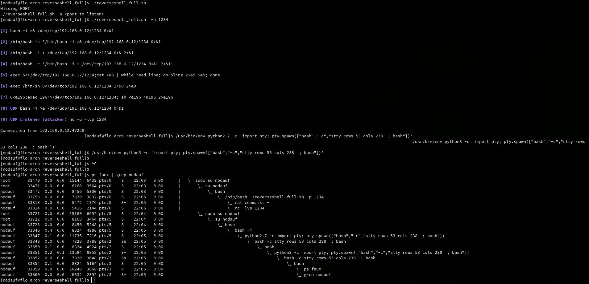

# full-reverse-shell
Script to automatically generate full interactive reverse shell. Spawn a pty with python and generate a terminal with correct size

## Installation

[Shellerator](https://github.com/ShutdownRepo/shellerator) should be installed
```
git clone https://github.com/ShutdownRepo/shellerator
pip3 install --user -r requirements.txt
```

Then
```
git clone https://github.com/nodauf/full-reverse-shell
```


## Usage


